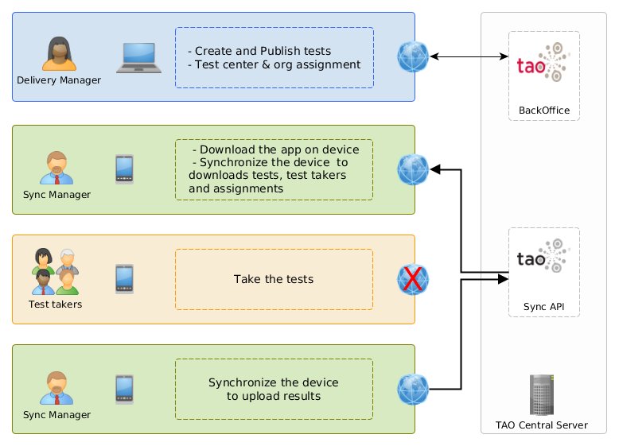

# TAO mobile test client

## !!! DEPRECATED / ARCHIVED REPOSITORY !!!

This repository contains the sources to build a TAO mobile client application for Android and iOS, using Cordova and PhoneGap.

## Offline Test taking

The primary goal of this application is to let test taker take tests without an internet connection, at least not during the test session.

The application is itself linked to a strong workflow, involving multiple users, and a TAO Central server.
The test creation, publication and assignment is done only in the TAO Central Server, the application will connect to this server, download the data for an offline usage.
The application is meant to be used by 2 roles of users :
 - a "Sync Manager" user which will install the application and synchronize the device.
 - "Test Takers" users who can take the test offline once the device has been synchronized.

### Download

The application binaries are availale from the [release section](https://github.com/oat-sa/tao-mobile-app/releases/)

### Documentation

Please find the documentation in the repository wiki :

 - [Architecture](https://github.com/oat-sa/tao-mobile-app/wiki/Architecture)
 - [Development](https://github.com/oat-sa/tao-mobile-app/wiki/Development)
 - [Build](https://github.com/oat-sa/tao-mobile-app/wiki/Build)
 - [FAQ](https://github.com/oat-sa/tao-mobile-app/wiki/FAQ)

### License

2018 © Open Assessment Technology SA
Licensed under the terms of the GNU GENERAL PUBLIC LICENSE, Version 2

